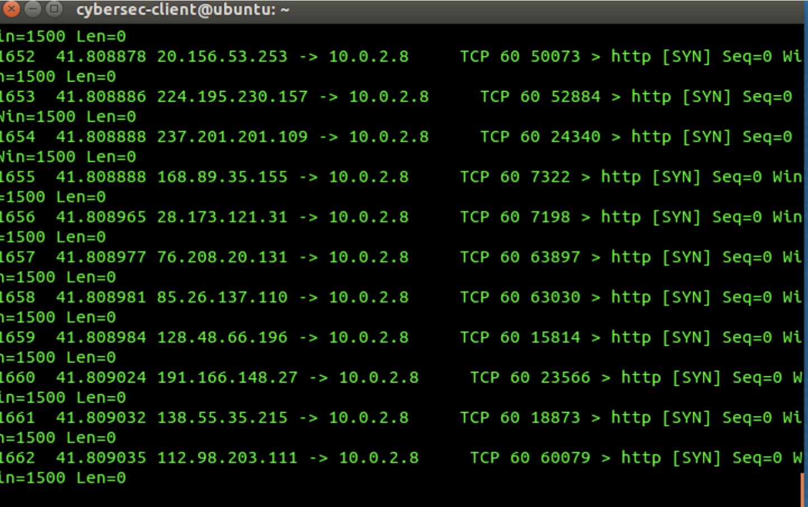
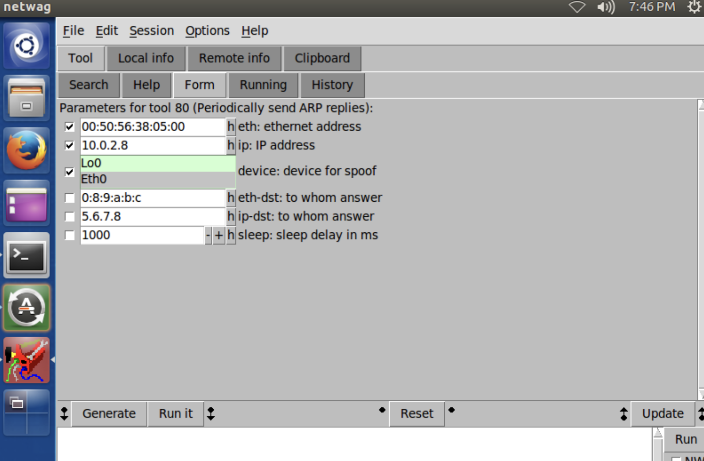
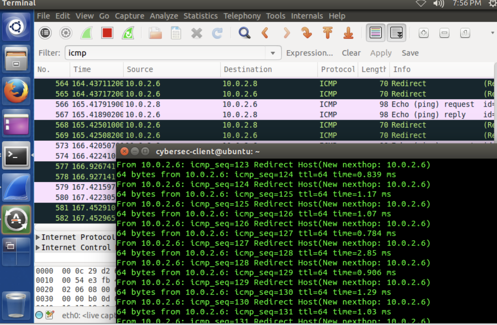

# Network Attack Simulation and Analysis Lab

## Overview

This project documents a controlled university cybersecurity lab examining three network-based attacks: TCP SYN flooding, ARP cache poisoning and ICMP redirect spoofing.

Each attack was reproduced in an isolated virtual environment so that its network behavior and security impact could be observed. The results were then analyzed from a defensive perspective, with appropriate mitigation strategies identified for each technique.

> **Ethical Scope:** All traffic generation and attack simulation were performed in an isolated and authorized university lab environment. The techniques documented in this repository are presented strictly for educational and defensive purposes.

## Lab Objectives

- Observe the behavior of a TCP SYN flood.
- Understand how half-open TCP connections can affect service availability.
- Analyze the relationship between SYN flooding and denial-of-service attacks.
- Observe how a forged ARP reply can poison an ARP cache.
- Examine how ICMP redirect messages can manipulate network routing.
- Identify the security risks associated with each attack.
- Recommend appropriate defensive and mitigation measures.
- Document technical evidence without exposing personal or sensitive information.

## Tools and Environment

- Linux virtual machines
- VMware
- Wireshark
- Netwag/Netwox packet-generation tools
- TCP/IP networking utilities
- ARP utilities
- ICMP utilities

---

## 1. TCP SYN Flood Analysis

### Attack Technique

A normal TCP connection begins with a three-way handshake:

1. The client sends a `SYN` packet.
2. The server responds with `SYN-ACK`.
3. The client completes the connection within an `ACK`.

During a SYN flood, a large number of connection requests are sent without completing the final acknowledgement. The server may retain these incomplete sessions as half-open connections, consuming resources intended for legitimate clients.

### Observing the SYN Flood

The controlled SYN-flood scenario was observed within the isolated lab network.

**Observation:** The victim received numerous TCP packets with the `SYN` flag, but the corresponding connections were not completed with final acknowledgements.

**Result:** Multiple half-open connections were created, demonstrating how a SYN flood can consume the server's connection-tracking resources and interfere with legitimate service availability.

### Severity and DoS Classification

A SYN flood is a denial-of-service attack because its objective is to reduce or prevent access to a network service. If the attack is distributed across many source systems, it may become a distributed denial-of-service attack.

The severity depends on:

- The number and frequency of SYN packets.
- The server's available memory and connection backlog.
- The duration of the attack.
- The effectiveness of network filtering and rate limiting.
- Whether the traffic originates from one or many sources.
- The importance of the affected service.

### Defensive Recommendations

Potential defences include:

- Enabling TCP SYN cookies.
- Increasing the server's connection backlog where appropriate.
- Reducing the timeout for incomplete connections.
- Applying rate limits to excessive SYN traffic.
- Using stateful firewall and intrusion-prevention controls.
- Monitoring sudden increases in half-open connections.
- Alerting on abnormal SYN-to-ACK ratios.
- Using upstream DDoS protection for internet-facing services.

---

## 2. ARP Cache Poisoning Analysis

### Attack Technique 

The address Resolution Protocol (ARP) maps IPv4 addresses to MAC addresses within a local network. Devices store these mappings temporarily in an ARP cache.

ARP does not provide built-in authentication. A forged ARP reply may therefore cause a device to associate a legitimate IP addresses within an incorrect MAC address.

An attacker may use ARP cache poisoning to:

- Redirect network traffic.
- Position themselves between two communicating systems.
- Observe unencrypted information.
- Modify traffic in transit.
- Disrupt network connectivity.

### Observing the Forged ARP Reply

A controlled forged ARP reply was generated within the isolated lab network.

**Observation:** The server accepted the forged ARP information and updated its cache with an incorrect MAC-address mapping.

**Result:** The experiment demonstrated how a device can trust an unsolicited or falsified ARP reply when no additional protections are enabled.

### Security Analysis

ARP cache poisoning can support a man-in-the-middle attack by causing traffic to pass through an attacker-controlled system. It can also create a denial-of-service condition if traffic is redirected to an invalid or unreachable destination.

The impact is generally limited to the local broadcast domain, but the attack can still expose sensitive internal communications.

### Defensive Recommendations

Potential defences include:

- Configuring static ARP entries for critical systems where pratical.
- Enabling Dynamic ARP Inspection on supported switches.
- Using DHCP snooping to establish trusted address bindings.
- Segmenting networks to reduce the size of broadcast domains.
- Monitoring unexpected changes in IP-to-MAC mappings.
- Alerting when one MAC address becomes associated with multiple IP addresses.
- Using encrypted protocols such as SSH, HTTPS, and TLS.
- Applying port-security controls on managed switches.

---

# 3. ICMP Redirect Spoofing Analysis

### Attack Technique

ICMP redirect messages are intended to inform a host that a more appropriate gateway exists for reaching a particular destination.

If a host accepts an unauthorized or forged ICMP redirect, an attacker may attempt to alter its routing behavior. Traffic could then be redirected through an attacker-controlled system or sent to an incorrect gateway.

Potential consequences include:

- Network traffic interception.
- Man-in-the-middle positioning.
- Traffic manipulation.
- Loss of connectivity.
- Exposure of unencrypted information.

### Observing the ICMP Redirect

A controlled ICMP redirect packet was introduced into the isolated lab network while the resulting traffic was observed.

**Observation:** The victim accepted the spoofed ICMP redirect and processed the routing information contained in the message.

**Result:** The experiment demonstrated how trusting unauthorized redirect messages may allow an attacker to influence a host's network path.

### Security Analysis

ICMP redirect spoofing targets routing decisions rather than directly compromising an application. If an attacker successfully redirects traffic, the technique may support interception, manipulation or denial of sesrvice.

The practical impact depends on the host operating system, network configuration and whether ICMP redirects are accepted.

### Defensive Recommendations

Potential defences include:

- Disabling ICMP redirect acceptance on endpoints that do not require it.
- Preventing routers from sending unnecessary ICMP redirects.
- Using authenticated and securely configured routing protocols.
- Applying ingress filtering to reduce spoofed traffic.
- Monitoring unexpected routing-table changes.
- Alerting on ICMP redirect messages from unauthorized sources.
- Using encrypted application protocols to protect redirected traffic.
- Segmenting critical systems from untrusted network devices.

---

## Key Findings

| Attack | Observation | Security impact |
| --- | --- | --- |
| TCP SYN flood | Numerous SYN packets were received without completion of the TCP handshake | Half-open connections may consume resources and disrupt service availability |
| ARP cache poisoning | The victim accepted a forged IP-to-MAC address mapping | Traffic may be redirected, intercepted or disrupted within the local network |
| ICMP redirect spoofing | The victim accepted routing information from a spoofed redirect message | An attacker may influence the victim's network path |

## Attack Comparison

| characteristic | SYN flood | ARP poisoning | ICMP redirect spoofing |
| --- | --- | --- | --- |
| Primary target | Service availability | Local address resolution | Host routing decisions |
| Security property affected | Availability | Confidentiality, integrity and availability |
| Typical scope | Local or remote service | Local broadcast domain | Host or local network |
| Main indicator | High volume of incomplete TCP handshakes | Unexpected IP-to-MAC mapping changes | Unexpected ICMP redirect messages |
| Example defence | SYN cookies and rate limiting | Dynamic ARP Inspection | Disable unnecessary ICMP redirects |

## Defensive Recommendations

